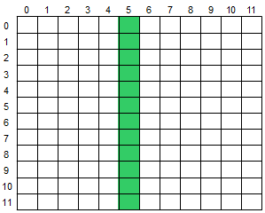
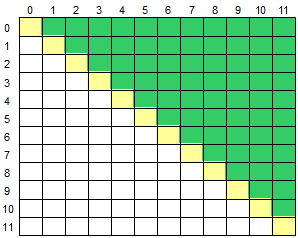

> Projeto baseado nos desafios propostos pelo Bootcamping Inter Android Developer
> 

| Desafio                 | Tema do Desafio                  | Nível do Desafio | Respostas                              |
| ----------------------- | -------------------------------- | ---------------- | -------------------------------------- |
| [Desafio 1](#ancora1)   | Desafios Matemáticos em Kotlin   | Básico           | [Resolução](src/desafios/Desafio1.kt)  |
| [Desafio 2](#ancora2)   | Desafios Matemáticos em Kotlin   | Básico           | [Resolução](src/desafios/Desafio2.kt)  |
| [Desafio 3](#ancora3)   | Desafios Matemáticos em Kotlin   | Básico           | [Resolução](src/desafios/Desafio3.kt)  |
| [Desafio 4](#ancora4)   | Praticando Aritmética em Kotlin  | Intermediário    | [Resolução](src/desafios/Desafio4.kt)  |
| [Desafio 5](#ancora5)   | Praticando Aritmética em Kotlin  | Intermediário    | [Resolução](src/desafios/Desafio5.kt)  |
| [Desafio 6](#ancora6)   | Praticando Aritmética em Kotlin  | Intermediário    | [Resolução](src/desafios/Desafio6.kt)  |
| [Desafio 7](#ancora7)   | Praticando Aritmética em Kotlin  | Intermediário    | [Resolução](src/desafios/Desafio7.kt)  |
| [Desafio 8](#ancora8)   | Praticando Aritmética em Kotlin  | Intermediário    | [Resolução](src/desafios/Desafio8.kt)  |
| [Desafio 9](#ancora9)   | Solucionando Problemas em Kotlin | Avançado         | [Resolução](src/desafios/Desafio9.kt)  |
| [Desafio 10](#ancora10) | Solucionando Problemas em Kotlin | Avançado         | [Resolução](src/desafios/Desafio10.kt) |
| [Desafio 11](#ancora11) | Solucionando Problemas em Kotlin | Avançado         | [Resolução](src/desafios/Desafio11.kt) |

# [Desafio 1](#ancora)
> Você deve fazer a leitura de 5 valores inteiros. Em seguida mostre quantos valores informados são pares, quantos valores informados são ímpares, quantos valores informados são positivos e quantos valores informados são negativos.

## Entrada

Você receberá 5 valores inteiros.

## Saída

Exiba a mensagem conforme o exemplo de saída abaixo, sendo uma mensagem por linha e não esquecendo o final de linha após cada uma.

| Exemplos de Entrada           | Exemplos de Saída                                            |
| ----------------------------- | ------------------------------------------------------------ |
| -5 0 -3 -4 12 | 3 valor(es) par(es) 2 valor(es) impar(es) 1 valor(es) positivo(s) 3 valor(es) negativo(s) |

# [Desafio 2](#ancora)

>  Você deve calcular o consumo médio de um automóvel onde será informada a distância total percorrida (em Km) e o total de combustível consumido (em litros).

## Entrada

Você receberá dois valores: um valor inteiro **X** com a distância total percorrida (em Km), e um valor real **Y** que representa o total de combustível consumido, com um dígito após o ponto decimal.

## Saída

Exiba o valor que representa o consumo médio do automóvel (3 casas após a vírgula), incluindo no final a mensagem "km/l".

| Exemplo de Entrada | Exemplo de Saída |
| ------------------ | ---------------- |
| 500 35.0       | 14.286 km/l      |
| 2254 124.4     | 18.119 km/l      |
| 4554 464.6     | 9.802 km/l       |

# [Desafio 3](#ancora3)
> Em 2015 um novo record foi alcançado na competição de Coxinhas de Bueno de Andrada, onde Mônica mandou pra dentro 43 coxinhas em apenas 10 minutos, passando se antecessor que conseguiu comer, no mesmo tempo, 38 coxinhas em 2014.
>
> O restaurante especializado em coxinhas do pequeno distrito de Bueno de Andrada, interior de São Paulo, organiza essa competição todos os anos, mas nunca conseguiram entrar para o livro dos recordes, o Guinness Book. Para isso, o restaurante precisa preencher informações sobre a competição, como o número de coxinhas consumidas pelos competidores durante o evento. 
>
> Porém, como já foi informado, a especialidade deles é coxinha, não matemática, então será que você pode ajudá-los? Com base no número total de coxinhas consumidas e o número de participantes na competição, o dono do restaurante precisa que você desenvolva um programa para saber a quantidade média de coxinha que os participantes da competição conseguem devorar.
>
> Ah, lembre que, em troca da sua ajuda, você poderá comer quantas coxinhas conseguir.

## Entrada

A entrada consiste de uma única linha que contém dois inteiros **H** e **P** (1 ≤ **H, P** ≤ 1000) indicando respectivamente o número total de coxinhas consumidas e o número total de participantes na competição.

## Saída

Seu programa deve produzir uma única linha com um número racional representando o número médio de coxinhas consumidas pelos participantes. O resultado deve ser escrito como um número racional com exatamente dois dígitos após o ponto decimal, arredondado se necessário.

| Exemplos de Entrada | Exemplos de Saída |
| ------------------- | ----------------- |
| 10 90               | 0.11              |
| 840 11              | 76.36             |
| 1 50                | 0.02              |

# [Desafio 4](#ancora)
> Neste problema você deve ler um número que indica uma coluna de uma matriz na qual uma operação deve ser realizada, um caractere maiúsculo, indicando a operação que será realizada, e todos os elementos de uma matriz M 12x12. Em seguida, calcule e mostre a soma ou a média dos elementos que estão na área verde da matriz, conforme for o caso. A imagem abaixo ilustra o caso da entrada do valor 5 para a coluna da matriz, demonstrando os elementos que deverão ser considerados na operação.
>
> 

## Entrada

A primeira linha de entrada contem um número **C** (0 ≤ **C** ≤ 11) indicando a coluna que será considerada para operação. A segunda linha de entrada contém um único caractere Maiúsculo **T** ('S' ou 'M'), indicando a operação (Soma ou Média) que deverá ser realizada com os elementos da matriz. Seguem os 144 valores de ponto flutuante que compõem a matriz.

## Saída

Imprima o resultado solicitado (a soma ou média), com 1 casa após o ponto decimal.

| Exemplo de Entrada                               | Exemplo de Saída |
| ------------------------------------------------ | ---------------- |
| 5 S 0.0 -3.5 2.5 4.1 ... | 12.6             |

# [Desafio 5](#ancora)
> Você recebeu o desafio de ler um valor e criar um programa que coloque o valor lido na primeira posição de um vetor N[10]. Em cada posição subsequente, coloque o dobro do valor da posição anterior. Por exemplo, se o valor lido for 1, os valores do vetor devem ser 1,2,4,8 e assim sucessivamente. Mostre o vetor em seguida.

## Entrada

A entrada contém um valor inteiro **(V<=50)**.

## Saída

Para cada posição do vetor, escreva "N[**i**] = **X**", onde **i** é a posição do vetor e **X** é o valor armazenado na posição **i**. O primeiro número do vetor N (N[0]) irá receber o valor de V.

| Exemplo de Entrada | Exemplo de Saída                           |
| ------------------ | ------------------------------------------ |
| 1                  | N[0] = 1 N[1] = 2 N[2] = 4 ... |

# [Desafio 6](#ancora)
> Faça um programa que leia um vetor X[10]. Substitua a seguir, todos os valores nulos e negativos do vetor X por 1. Em seguida mostre o vetor X.

## Entrada

A entrada contém 10 valores inteiros, podendo ser positivos ou negativos.

## Saída

Para cada posição do vetor, escreva "X[**i**] = **x**", onde **i** é a posição do vetor e **x** é o valor armazenado naquela posição.

| Exemplo de Entrada            | Exemplo de Saída                                         |
| ----------------------------- | -------------------------------------------------------- |
| 0 -5 63 0 ... | X[0] = 1 X[1] = 1 X[2] = 63 X[3] = 1 ... |

# [Desafio 7](#ancora)
> A seguinte sequência de números 0 1 1 2 3 5 8 13 21... é conhecida como série de Fibonacci. Nessa sequência, cada número, depois dos 2 primeiros, é igual à soma dos 2 anteriores. Escreva um algoritmo que leia um inteiro N (N < 46) e mostre os N primeiros números dessa série.

## Entrada

O arquivo de entrada contém um valor inteiro N (0 < N < 46).

## Saída

Os valores devem ser mostrados na mesma linha, separados por um espaço em branco. Não deve haver espaço após o último valor.

| Exemplos de Entrada | Exemplos de Saída |
| ------------------- | ----------------- |
| 5                   | 0 1 1 2 3         |

# [Desafio 8](#ancora)
> Crie um programa que leia um número e mostre os números pares até esse número, inclusive ele mesmo.

## Entrada
Você receberá 1 valor inteiro **N**, onde **N > 0**.

## Saída

Exiba todos os números pares até o valor de entrada, sendo um em cada linha. 

| Exemplo de Entrada | Exemplo de Saída |
| ------------------ | ---------------- |
| 6                  | 2 4 6    |
# [Desafio 9](#ancora)
> A fórmula para calcular a área de uma circunferência é: **area = π . raio2**. Considerando para este problema que **π =** 3.14159:
>
> Efetue o cálculo da área, elevando o valor de **raio** ao quadrado e multiplicando por **π**.

## Entrada

A entrada contém um valor de ponto flutuante (dupla precisão), no caso, a variável **raio**.

## Saída

Apresentar a mensagem "A=" seguido pelo valor da variável **area**, conforme exemplo abaixo, com 4 casas após o ponto decimal. Utilize variáveis de dupla precisão (double). Como todos os problemas, não esqueça de imprimir o fim de linha após o resultado, caso contrário, você receberá "Presentation Error".

| Exemplos de Entrada | Exemplos de Saída |
| ------------------- | ----------------- |
| 2.00                | A=12.5664         |
| 100.64              | A=31819.3103      |
| 150.00              | A=70685.7750      |

# [Desafio 10](#ancora)
> Leia um caractere maiúsculo, que indica uma operação que deve ser realizada e uma matriz **M**[12]x[12]. Em seguida, calcule e mostre a soma ou a média considerando somente aqueles elementos que estão acima da diagonal principal da matriz, conforme ilustrado abaixo (área verde).
>
> 

## Entrada

A primeira linha de entrada contem um único caractere Maiúsculo **O** ('S' ou 'M'), indicando a operação (Soma ou Média) que deverá ser realizada com os elementos da matriz. Seguem os 144 valores de ponto flutuante que compõem a matriz.

## Saída

Imprima o resultado solicitado (a soma ou média), com 1 casa após o ponto decimal.

| Exemplo de Entrada                                 | Exemplo de Saída |
| -------------------------------------------------- | ---------------- |
| S 1.0 0.0 -3.5 2.5 4.1 ... | 12.6             |
# [Desafio 11](#ancora)
> Leia 2 valores de ponto flutuante de dupla precisão A e B, que correspondem a 2 notas de um aluno. A seguir, calcule a média do aluno, sabendo que a nota A tem peso 3.5 e a nota B tem peso 7.5 (A soma dos pesos portanto é 11). Assuma que cada nota pode ir de 0 até 10.0, sempre com uma casa decimal.

## Entrada

O arquivo de entrada contém 2 valores com uma casa decimal cada um.

## Saída

Calcule e imprima a variável **MEDIA** conforme exemplo abaixo, com 5 dígitos após o ponto decimal e com um espaço em branco antes e depois da igualdade. Utilize variáveis de dupla precisão (double) e como todos os problemas, não esqueça de imprimir o fim de linha após o resultado, caso contrário, você receberá "Presentation Error".

| Exemplos de Entrada | Exemplos de Saída |
| ------------------- | ----------------- |
| 5.0 7.1          | MEDIA = 6.43182   |
| 0.0 7.1          | MEDIA = 4.84091   |
| 10.0 10.0        | MEDIA = 10.00000  |
